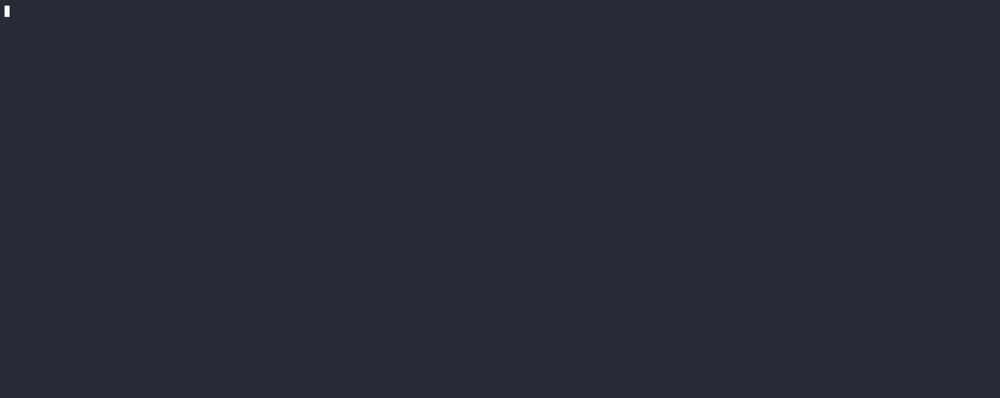
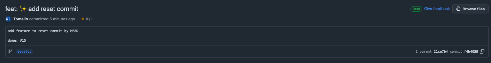

# gCommit

## Introduction

`gCommit` is a CLI tool designed to help you create conventional commits with ease. It provides an interactive mode to guide you through the process of crafting well-structured commit messages, ensuring consistency and readability in your commit history.

## Features

- Interactive mode for creating commit messages
- Supports emojis in commit messages
- Validates commit message length and format
- Integrates with Git for seamless commit creation

## Installation

To install `gCommit`, you need to have Go installed on your machine. Then, you can use the following command to install the tool:

```sh
go install github.com/Tomelin/gCommit@latest
````

## Usage

To use gCommit in interactive mode, simply run the following command:

```
gcommit --interactive
```

This will guide you through a series of prompts to create a commit message.

Non-Interactive Mode
You can also use **gCommit** in non-interactive mode by providing the commit message directly:

````
gcommit --commit "feat: add new feature"
````

## Example
Here is an example of how to use **gCommit** in interactive mode:


**Result of the commit**


You chose ```feat: :sparkles: Add new feature for user authentication"```

Contributing
We welcome contributions to gCommit. If you would like to contribute, please fork the repository and submit a pull request.

License
This project is licensed under the MIT License. See the LICENSE file for details.